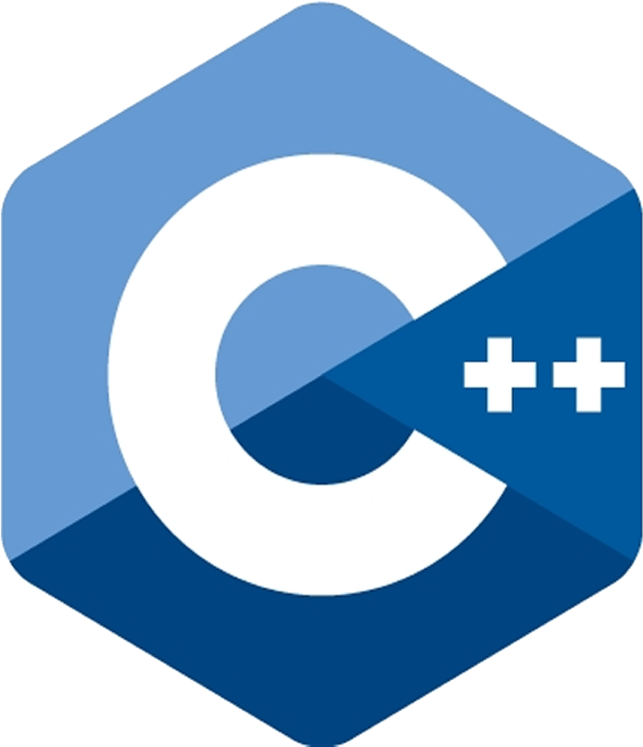

<!-- --------------------------------------------------------------------------------------------------------------------------------------- -->

<h1 align="center">Hi 👋, I'm Shubh<!-- --></h1>

<!-- --------------------------------------------------------------------------------------------------------------------------------------- -->
<!--   -->

 <kbd></kbd> 

<!--  -->

<!-- --------------------------------------------------------------------------------------------------------------------------------------- -->

<h2 align="center">A Developer [ WEB / APP / BOT ]</h2>
<!-- 
 -->

- 🎀 I'm a student.
- 🌱 Currently styding at <a href="http://www.nitjsr.ac.in" target="_blank" rel="noopener" >NIT Jamshedpur</a>.
- 👨‍💻 I did some project you can check <a href=" https://soshubh.github.io/#work" target="_blank" rel="noopener" >here</a>.
- 📫 For contact <a href=" https://soshubh.github.io/#contact" target="_blank" rel="noopener" >click here</a>.
<!-- - [click here](http://soshubh.xyz/#contact). -->

<!-- --------------------------------------------------------------------------------------------------------------------------------------- -->

<h2 align="center">Work On Development</h2>
<!-- 
 -->

- 🌐 Web Development

   <a href="https://soshubh.netlify.app/">Shubhanshu Singh</a>
    <a href="http://soshubh.xyz">SHUBH SINGH</a>
    <a href="https://how-to-not-do-nimct.glitch.me">HTNDNIMCET</a>
<!--     <a href="https://shubhanshusingh.live/">Shubhanshu Singh</a> -->
   
- 🤖 Bot Development

  <a href="http://t.me/nitjamshedpurbot">NIT Jamshedpur</a>
   <a href="http://t.me/so_shubh_bot">SHUBH SINGH</a>
   <a href="https://discord.com/oauth2/authorize?client_id=920213432739967008&permissions=70282305&scope=bot">Noob Coders </a>
 
 - 🖼️ UI Design
 
   <a href="https://www.figma.com/proto/BER4LIkHMHwebRGU5gtNvH/Untitled-(Copy)?page-id=0%3A1&node-id=42%3A2&viewport=193%2C316%2C0.16&scaling=scale-down&starting-point-node-id=42%3A2">Post Your Thoughts</a>
 
  
 
<!-- --------------------------------------------------------------------------------------------------------------------------------------- -->

<h2 align="center">Skill</h2>

  
  
   
  
  
   
  
   
   
  
  
  
  

<!-- --------------------------------------------------------------------------------------------------------------------------------------- -->

<h2 align="center">Tool's</h2>

 

  <code></code>
  <code></code>
  <code></code> 
  <code></code>
  <code></code> 
  <code></code> 
  <code></code>
  <code></code>
<!--   <code></code>  -->
 

<!-- ----------------------------------------------------------------------------------------------------------------------------------------->

<h2 align="center">Social & Hobbies</h2>

 
 
 
 
 
 
    

<!-- --------------------------------------------------------------------------------------------------------------------------------------- -->

<!--  -->
<h2 align="center">Language's and Stat's</h2>

|  |  |
| ------------- | ------------- |

<!-- --------------------------------------------------------------------------------------------------------------------------------------- -->   
<!-- 
 -->
<!-- ## 🏆 GitHub Trophies -->
<h2 align="center">GitHub Trophies</h2>
<a href="https://github-profile-trophy.vercel.app/?username=soshubh&theme=radical&no-frame=false&no-bg=false&margin-w=4"/>
|  |
| ----------------------------- |

<!-- --------------------------------------------------------------------------------------------------------------------------------------- -->   
<h2 align="center">Project's</h2>

|   |   |
| ------------- | ------------- |

 
<!-- --------------------------------------------------------------------------------------------------------------------------------------- -->
